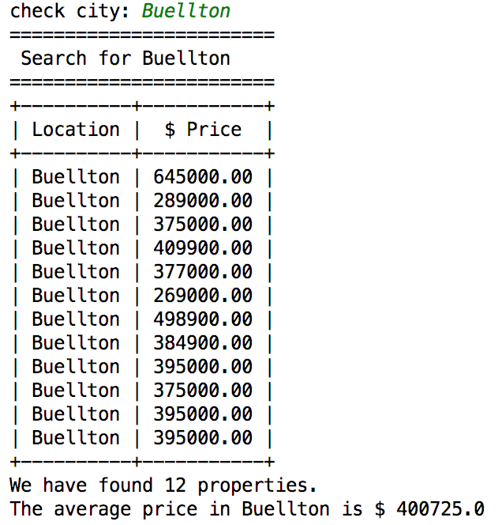
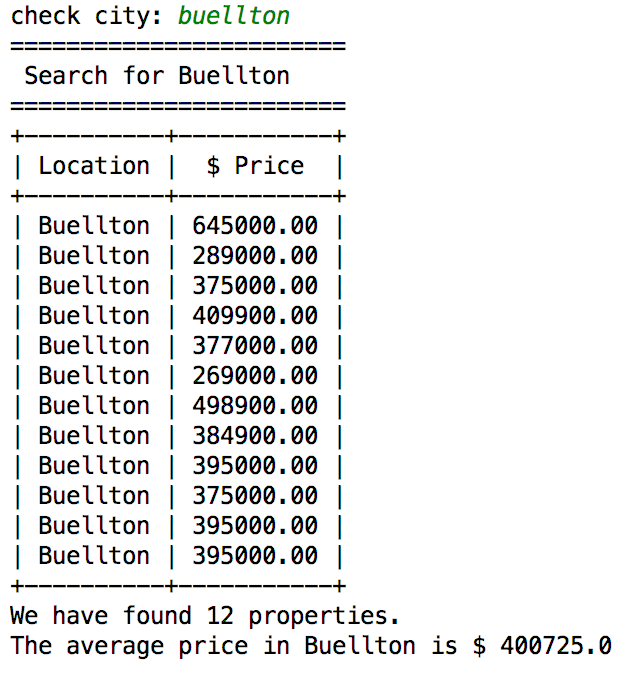
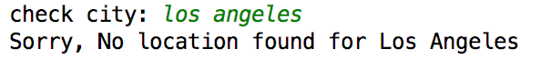

# Read CSV file and search by Location
This script will read the data from CSV files and search location by user input. This will return "no result found" if there is no match in CSV file. It will also display the total number of properties found at a given location and the average price is a particular city.

Install requirements.txt

$pip install -r requirements.txt
 
# ---- Demo ----
This home screen will display "check city" option for the user input. 

This will also convert lower case letters to capital.

This will also prompt an error message if thre will be no result.

